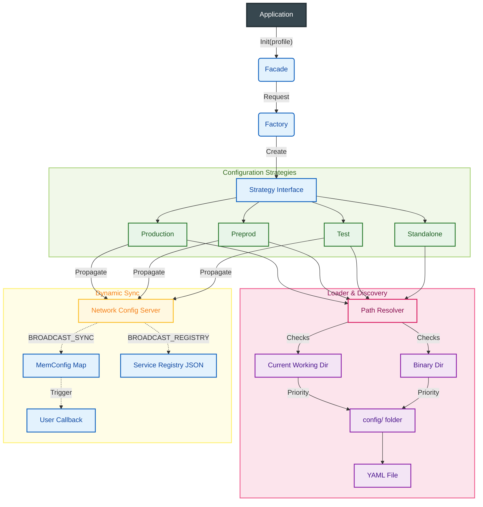

# Architecture

This document describes the internal design of the Distributed Config library.

## Data Flow

The following diagram illustrates how the library discovers, loads, and synchronizes configuration data across different environments.

## Key Components

### 1. Facade (`src/facade`)
The primary entry point (`distributed_config.New(profile)`). It acts as a wrapper around the core data, providing:
*   **Static Access**: Direct access to YAML-loaded fields (e.g., `cfg.Common.Name`).
*   **Dynamic Access**: Access to the `MemConfig` map for runtime updates.
*   **Callbacks**: Mechanism to register listeners (`OnMemConfUpdate`) for remote configuration changes.

### 2. Loader & Discovery (`src/loader`)
Handles the complex logic of finding and parsing configuration files.
*   **Path Resolver**: Automatically searches for YAML files in multiple locations (CWD, Binary Directory, and their respective `config/` subfolders).
*   **Precedence**: Explicitly prioritized to allow `config/default.yaml` or project-specific files to override generated skeletons.
*   **Env Expansion**: Processes `${VAR_NAME}` syntax during YAML parsing.

### 3. Strategies (`src/strategies`)
Implements the core logic for retrieving and synchronizing configuration based on the requested profile.
*   **Production**: Full bidirectional sync (GET/PUT) with the Config Server. authoritative local file.
*   **Preprod**: Read-only sync (GET) with the Config Server.
*   **Test**: Bootstraps with local defaults (e.g., `127.0.0.2`) then mimics Production behavior.
*   **Standalone**: Offline mode. Only uses local file discovery via the Loader.

### 4. Network & Protocol (`src/network`)
Manages communication with the remote Config Server using a slimmed-down Protobuf protocol wrapping unstructured JSON arrays/maps.
*   **Safe Socket**: High-performance TCP communication via `github.com/Bastien-Antigravity/safe-socket`.
*   **Proto Handler**: Parses generic `GET_SYNC`, `PUT_SYNC`, `BROADCAST_SYNC`, and `BROADCAST_REGISTRY` commands. Routes unstructured JSON blobs to `MemConfig` or Registry callbacks without needing rigidly coupled structs.

## Configuration Precedence

1.  **Code Defaults**: Hardcoded values in `NewDefaultConfig()`.
2.  **Remote Sync** (Dynamic): Merged into `MemConfig` at runtime.
3.  **Local YAML**: Discovered via the Loader. **Value in YAML always overrides Server/Default values.**
4.  **Environment Variables**: Overwrite corresponding YAML values via expansion.
