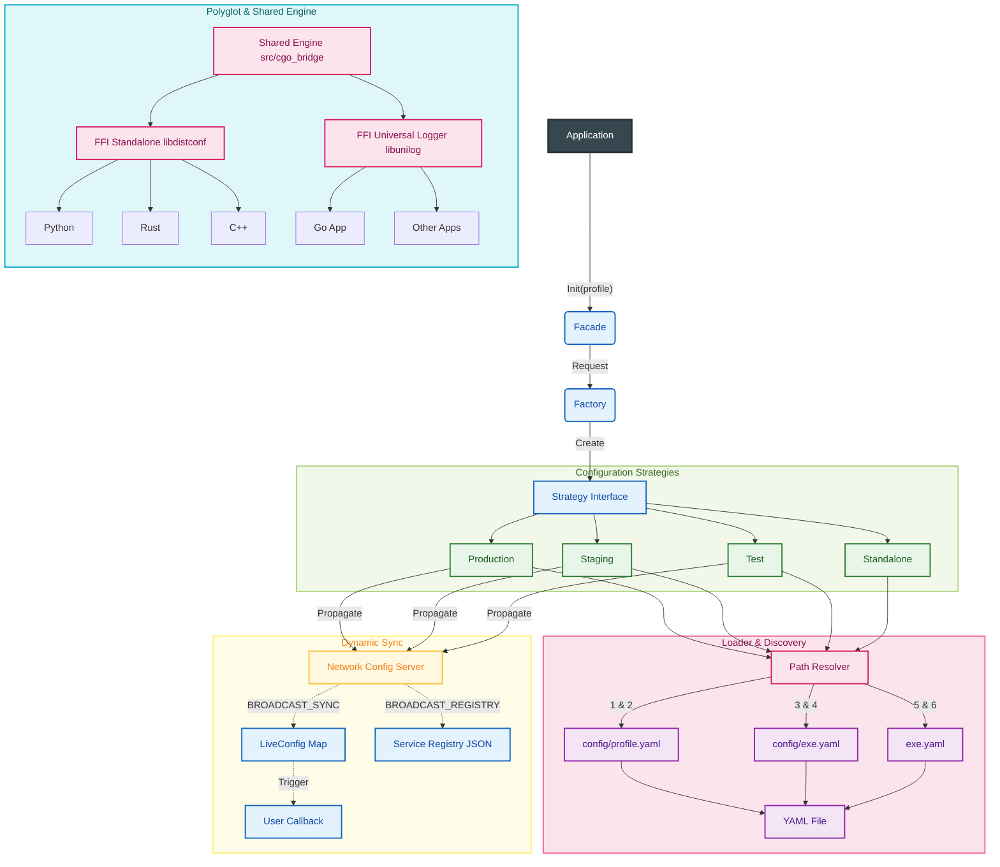

# Architecture

This document describes the internal design of the Distributed Config library.

## Data Flow

The following diagram illustrates how the library discovers, loads, and synchronizes configuration data across different environments.

```mermaid
flowchart TD
    %% Styles
    classDef core fill:#e3f2fd,stroke:#1565c0,stroke-width:2px,color:#0d47a1;
    classDef strategy fill:#e8f5e9,stroke:#2e7d32,stroke-width:2px,color:#1b5e20;
    classDef net fill:#fff8e1,stroke:#fbc02d,stroke-width:2px,color:#f57f17;
    classDef file fill:#f3e5f5,stroke:#8e24aa,stroke-width:2px,color:#4a148c;
    classDef loader fill:#fce4ec,stroke:#d81b60,stroke-width:2px,color:#880e4f;

    %% Application Node Styling
    style App fill:#37474f,stroke:#263238,stroke-width:3px,color:#ffffff

    %% Nodes
    App[Application] -->|"Init(profile)"| Facade(Facade):::core
    Facade -->|Request| Factory(Factory):::core
    Factory -->|Create| StratInterface[Strategy Interface]:::core

    subgraph Strategies [Configuration Strategies]
        direction TB
        StratInterface --> Prod[Production]:::strategy
        StratInterface --> Stag[Staging]:::strategy
        StratInterface --> Test[Test]:::strategy
        StratInterface --> Stand[Standalone]:::strategy
    end
    style Strategies fill:#f1f8e9,stroke:#aed581,stroke-width:2px,color:#33691e

    subgraph Discovery [Loader & Discovery]
        direction TB
        Prod & Stag & Test & Stand --> Loader[Path Resolver]:::loader
        Loader -->|1 & 2| ConfigSub[config/profile.yaml]:::file
        Loader -->|3 & 4| ConfigDef[config/exe.yaml]:::file
        Loader -->|5 & 6| RootDef[exe.yaml]:::file
        ConfigSub & ConfigDef & RootDef --> YAML[YAML File]:::file
    end
    style Discovery fill:#fce4ec,stroke:#f06292,stroke-width:2px,color:#880e4f

    subgraph Polyglot [Polyglot & Shared Engine]
        direction TB
        Logic[Shared Engine src/cgo_bridge]:::loader
        FFI_Dist[FFI Standalone libdistconf]:::loader
        FFI_Log[FFI Universal Logger libunilog]:::loader
        
        Logic --> FFI_Dist
        Logic --> FFI_Log
        
        FFI_Dist --> Py[Python] & Rs[Rust] & CPP[C++]
        FFI_Log --> GoLogger[Go App] & Apps[Other Apps]
    end
    style Polyglot fill:#e0f7fa,stroke:#00acc1,stroke-width:2px,color:#006064

    subgraph Sync [Dynamic Sync]
        direction TB
        Prod & Stag & Test -->|Propagate| Net[Network Config Server]:::net
        Net -.->|BROADCAST_SYNC| LiveConfig[LiveConfig Map]:::core
        Net -.->|BROADCAST_REGISTRY| Registry[Service Registry JSON]:::core
        LiveConfig -.->|Trigger| Callback[User Callback]:::core
    end
    style Sync fill:#fffde7,stroke:#fff176,stroke-width:2px,color:#f57f17
```

## Key Components

### 1. Facade (`src/facade`)
The primary entry point (`distributed_config.New(profile)`). It acts as a wrapper around the core data, providing:
*   **Static Access**: Direct access to YAML-loaded fields (e.g., `cfg.Common.Name`).
*   **Dynamic Access**: Access to the `LiveConfig` map for runtime updates.
*   **Callbacks**: Mechanism to register listeners (`OnLiveConfUpdate`) for remote configuration changes.

### 2. Loader & Discovery (`src/loader`)
Handles the complex logic of finding and parsing configuration files.
*   **Path Resolver**: Automatically searches for YAML files in a strict 6-step sequence (CWD then Binary Directory, prioritizing `config/` profile files then binary-name fallbacks).
*   **Fail-Fast Logic**: Automatically validates critical services (Log Server, Config Server) during the load phase to prevent boot on misconfiguration.
*   **Env Expansion**: Processes `${VAR_NAME}` syntax during YAML parsing.

### 3. Strategies (`src/strategies`)
Implements the core logic for retrieving and synchronizing configuration based on the requested profile.
*   **Production**: Full bidirectional sync (GET/PUT) with the Config Server. Local file is optional if core ENVs are provided.
*   **Staging**: Read-only sync (GET) with the Config Server. Local file is optional if core ENVs are provided.
*   **Test**: Bootstraps with local defaults (e.g., `127.0.0.2`) then mimics Production behavior.
*   **Standalone**: Offline mode. Only uses local file discovery via the Loader.

### 4. Network & Protocol (`src/network`)
Manages communication with the remote Config Server using a slimmed-down Protobuf protocol wrapping unstructured JSON arrays/maps.
*   **Safe Socket**: High-performance TCP communication via `github.com/Bastien-Antigravity/safe-socket`.
*   **Proto Handler**: Parses generic `GET_SYNC`, `PUT_SYNC`, `BROADCAST_SYNC`, and `BROADCAST_REGISTRY` commands. Routes unstructured JSON blobs to `LiveConfig` or Registry callbacks without needing rigidly coupled structs.

### 5. Shared CGO Engine (`src/cgo_bridge`)
The engine logic is decoupled from the FFI exports to allow multiple entry points (Standalone vs. Universal Logger) to share the same runtime state.
*   **Pure Go Logic**: All bridge logic resides in a pure Go package. It contains no `//export` statements, preventing linker symbol collisions when multiple libraries are linked into the same process.
*   **Memory Space Unification**: By importing the same `src/cgo_bridge` package, both `libdistconf` and `libunilog` share the same global `FacadeStore`. This ensures that a configuration update in one is immediately visible to the other.
*   **Handle-based Lifecycle**: Manages multiple concurrent configuration sessions via opaque handles, preventing memory leaks in FFI layers.
*   **JSON Pass-through**: Uses JSON as the primary data exchange format for complex capabilities, ensuring forward compatibility without breaking FFI signatures.
*   **Behavioral Parity**: Strictly reuses the Go core logic for environment expansion, path discovery, and validation, ensuring "identical-by-design" behavior across Python, Rust, and C++.

## High Performance & Concurrency

The library is designed for high-frequency microservices where configuration reads must be non-blocking.

### Atomic Pointer Swap (RCU)
To avoid unnecessary locks and mutex contention, the `LiveConfig` storage utilizes an `atomic.Pointer` to the configuration map.
*   **Lock-Free Reads**: The `Get()` operation performs a lock-free load of the pointer. This ensures that application threads never block, even during a massive network update.
*   **Snapshot Isolation**: Readers always see a consistent, immutable snapshot of the configuration.
*   **Atomic Updates**: Both local `Set()` calls and remote `BROADCAST_SYNC` updates follow the Read-Copy-Update (RCU) pattern. A new map is prepared and then atomically swapped into place, ensuring 100% snapshot integrity for all concurrent readers.

## FFI Implementation Notes
 
### Shared Library Unloading (The `dlclose` Hang)
When wrapping the Go shared library in languages like Rust or Python, **it is critical to never unload the library (`dlclose`) once it has been loaded.**
*   **The Reason**: The Go runtime starts background threads (GC, scheduler) that do not support being shut down or re-initialized within the same process. Unloading the library while these threads are active causes the process to hang indefinitely.
*   **The Solution**: Always use a "load-once" pattern (e.g., leaked static references in Rust) to ensure the library remains resident for the life of the process.
 
### Handle Management
Always ensure that `DistConf_Close(handle)` is called via a finalizer or `Drop` implementation to prevent memory leaks in the Go-side `FacadeStore`.

## Configuration Precedence

1.  **Code Defaults**: Hardcoded values in `NewDefaultConfig()`.
2.  **Remote Sync** (Dynamic): Merged into `LiveConfig` at runtime.
3.  **Local YAML**: Discovered via the Loader. **Hardcoded values in YAML always override Server/Default/Environment values.**
4.  **Environment Variables**: Only overwrite corresponding YAML values if the YAML specifically uses the `${VAR}` expansion syntax or if the field is empty.
