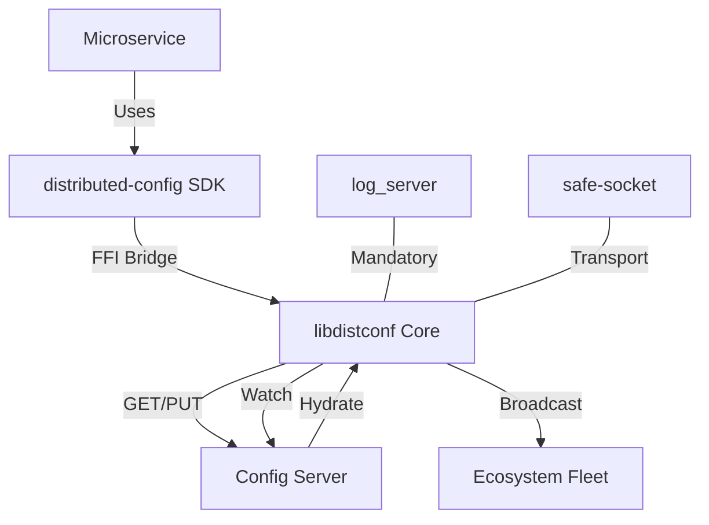

# Ecosystem Map: distributed-config

This document provides a high-level overview of how `distributed-config` interacts with other components in the Bastien-Antigravity ecosystem.

## 🔗 Connection Graph

## 🌍 Component Roles

### 1. `distributed-config` (The Library)
Acts as the "Config Agent" inside every microservice. It manages local file discovery, environment variable expansion, and remote synchronization.

### 2. `config-server` (The Authority)
The central source of truth for dynamic configuration and service discovery. It stores "LiveConfig" snapshots and manages the registry of active nodes.

### 3. `libdistconf` (The Polyglot Bridge)
A CGO-based shared library that enables Python, Rust, C++, and VBA applications to use the same Go-based configuration logic, ensuring 100% architectural parity.

### 4. `safe-socket` (The Transport)
The underlying communication layer providing resilient, encrypted, and multiplexed connections between the client and the server.

## 🚦 Integration Points

- **Service Registry**: Every microservice using this library automatically announces its presence to the fleet via the `config-server`.
- **Remote Broadcasting**: Use `ShareConfig()` to push local state (e.g., telemetry metrics, health status) to the entire ecosystem in real-time.
- **Mandatory Dependencies**: The library enforces connectivity to `log_server` and `config-server` before allowing the host application to finish booting.

## 📖 Related Docs
- [[Architecture-Overview|Architecture Overview]]
- [[Configuration-Behavior|Configuration Behavior]]
- [[Polyglot-SDK-Guide|Polyglot SDK Guide]]
- [[Security-and-Secrets|Security & Secrets]]
